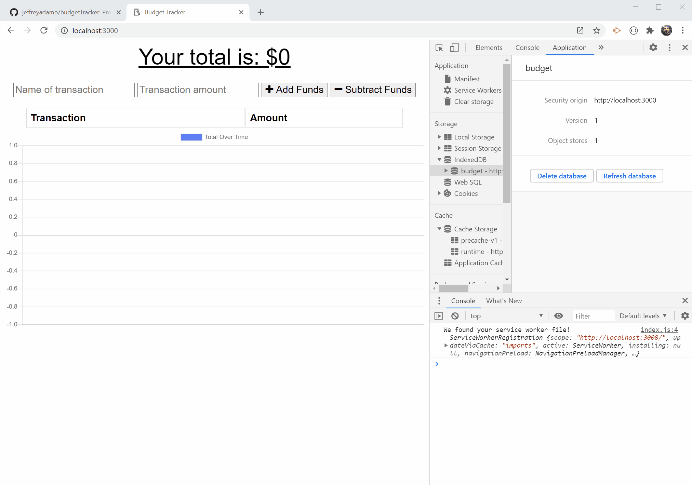

# Budget Tracker  
## *A Progressive Web Application*

Jeffrey Adamo  
UW Full Stack Web Development BootCamp - Week 18  
[Budget Tracker (PWA)](https://github.com/jeffreyadamo/budgetTracker) at GitHub Pages   
  
***

## Description

**Budget Tracker** is a full stack web application that has been adapted for offline use. Boilerplate code was provided by University of Washington's Full Stack Web Development program for the front-end design and back-end components necessary to run locally using a MongoDB NoSQL database. The requirements for this project was to make the **Budget Tracker** application  function offline as a *Progressive Web Application (PWA)* using *IndexedDB*, a *service worker* to utilize *Cache API*, and be able to run locally using *Manifest*.  

### User Story
~~~
 AS A USER looking to keep track of a budget by depositing and withdrawing expenses,  
 I WANT TO be able to use this app with our without an internet connection,   
 SO THAT I can keep track of my finances anywhere, anytime.
~~~

    <a href="https://www.youtube.com/watch?v=qxzEDtLlCgE&feature=youtu.be"> Budget Tracker demo on YouTube

## Table of Contents
* [Description](#description)

* [Installation](#installation)

* [Usage](#usage)

* [License](#license)

* [Contributing](#contributing)

* [Tests](#tests)

* [Questions](#questions)

## Installation

#### Please run the following for local hosting:

* Clone from the [GitHub repo](https://github.com/jeffreyadamo/budgetTracker)  
* run **npm install** in the cloned directory
* Ensure MongoDb is running: run **mongod** 
* run **npm start**

## Usage

This application provided boilerplate code for front and back end usage with MongoDb. Running **npm start** hosts locally on Port 3000 in the web browser.  

In order to make this app run offline, the following files where created:  
* /public/db.js 
* /public/service-worker.js 
* /public/manifest.webmanifest  

### Service worker
After the page is initially loaded, a [service worker](https://developers.google.com/web/fundamentals/primers/service-workers) is registered and installs a cache using *Cache API* on the browser. This can store files like index.html and style.css in order to render the app faster upon reload and for use offline. 

 
### IndexedDB
When the user is offline, an event handler recognizes the event change and utilizes the [IndexedDb](https://developer.mozilla.org/en-US/docs/Web/API/IndexedDB_API/Using_IndexedDB) feature of the browser to store inputs while offline. The supporting code is located in */public/db.js*. IndexedDb includes a "budget" database with an *object store* of "pending" and key value for the input received. This data will be pushed to the MongoDb upon reestablishing the internet connection using a POST request to "api/transaction/bulk". 

### Manifest
This app enables **Budget Tracker** to be a full [Progressive Web Application](https://web.dev/progressive-web-apps/) with the use of [Manifest](https://developer.mozilla.org/en-US/docs/Web/Manifest) that allows the website to be installed on the device's homescreen for offline use. Manifest is linked in the head of the HTML and details are stored in an object at */public/manifest.webmanifest*

## License

## Contributing

Leave an issue or comment at [GitHub](https://github.com/jeffreyadamo/budgetTracker).

## Tests

none

## Questions

For questions, open an issue or contact my GitHub  

    

@ [jeffreyadamo](http://www.github.com/jeffreyadamo)  

 